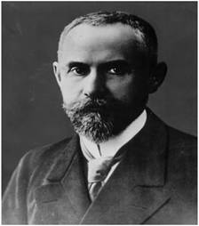
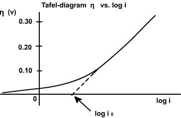
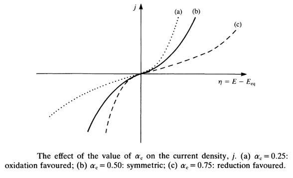

<h3>Introduction</h3>

Professor Julius Tafel, around 1905. (Courtesy Chemical Institute, Wurzburg University)

  Tafel's name is an adjective in the language of all trained electrochemists, yet not too many of them would even know his first name.
  The fame of the <strong>"Tafel law"</strong> and <strong>"Tafel line"</strong> overshadows Tafel's claim to fame as one of the 
  founders of modern electrochemistry.

  Until 1893, Tafel had lectured in organic chemistry, but after 1893 he lectured in physical and general chemistry. By German tradition, this would include extensive content in electrochemistry and hands-on experimentation. Through his work with strychnine reduction, Tafel had truly become an electrochemist. A careful observer, he was soon able to summarize major and far-reaching deductions from his experimental work.

<h2>Theory</h2>

<h4>Tafel Equation and Tafel Plots</h4>

The Tafel equation governs the irreversible behavior of an electrode. To understand this, we consider the general mechanism of electron transfer at an electrode.

Consider an electrolyte in which an inert or noble electrode is immersed. This is called the <strong>working electrode (WE)</strong>. Assume that both oxidized and reduced species are present near the electrode and participate in the following electron transfer reaction:

<em>Ox + ne− ⇌ Red</em>..................(1)

The rate of this electron transfer process depends on the overpotential applied and can be analyzed using the Tafel equation, which describes the relationship between the overpotential (η) and the logarithm of the current density (log i).

  <strong>O</strong> is the oxidized species and <strong>R</strong> is the reduced species present at equilibrium and stable in the solution.
  Let us assume that no other electron transfer reaction occurs apart from the one between O and R. 
  Let the concentrations of O and R be denoted as <strong>CO</strong> and <strong>CR</strong> respectively, and that these concentrations are very low.

  An inert electrolyte is also present to minimize IR drop. Along with the <strong>working electrode (WE)</strong>, a reference electrode <strong>RE</strong> is also immersed in the solution to form the cell.
  Since the potential of the reference electrode (RE) is constant, any variation in the cell emf corresponds to a variation in the working electrode potential (WE), and vice versa.

  At thermodynamic equilibrium of the system, no net current flows between the reference electrode (RE) and the working electrode (WE), no chemical reaction takes place, and hence the composition of the solution remains unchanged.
  The potential of the working electrode at equilibrium is denoted by <strong>Ee</strong>, which according to the Nernst equation is:

$$E_e = E_e^0 + \frac{RT}{nF} \ln\left( \frac{C_O}{C_R} \right)..............(2)$$

Where <strong>Ee0</strong> is the standard or formal reversible potential and is constant. 
The electrode potential <strong>Ee</strong> depends on the ratio of concentrations 
<em>[CO / CR]</em>. The square bracketed term should ideally be in terms of activity rather than molar concentration; however, at low concentrations, this replacement introduces negligible error.

The equilibrium mentioned above is dynamic. Though no net current flows across the electrodes, both reduction and oxidation occur at equal rates, so that the composition of the electrolyte remains unchanged. The dynamic flow of electrons or charge in both directions can be written in terms of current densities as follows.

$$I_0=I_A=-I_C...........(3)$$

Where <strong>IA</strong> is the anodic and <strong>-IC</strong> is the cathodic current density. By convention, anodic current density is given a positive sign and cathodic a negative sign. <strong>I0</strong> is known as the exchange current density. It may be defined as "the flow of charge or electrons across an electrochemical system in equilibrium." Its value is normally very low, of the order of 10-8 A°. It refers to the extent of both oxidation and reduction that occurs.

The equilibrium situation at an electrode is characterized by the equilibrium potential and exchange current density.

For the reaction to have practical significance, a net current should flow and a net reaction—either oxidation or reduction—should occur. For this, the kinetic aspect of the system must be considered. It is to be recalled that thermodynamics fixes the direction and kinetics determines the rate.

Let us apply an external potential to the working electrode (WE), making it more negative than <strong>Ee</strong>. This causes an increase in cathodic current and a net quantity of <strong>O</strong> will be reduced to <strong>R</strong>. The value of the ratio <em>[CO / CR]</em> at the electrode surface will diminish. The magnitude of the net cathodic current and the time taken to achieve the new ratio depends on the rate or the kinetics of the electron transfer reaction. The net cathodic current results from an increase in the partial cathodic current (<strong>-IC</strong>) and a decrease in the partial anodic current (<strong>IA</strong>) at this new potential. Hence, the reversible condition changes to an irreversible condition. This is achieved by applying a more negative potential—or excess potential—than <strong>Ee</strong>, which is known as overpotential.

Conversely, it can be argued that if the working electrode (WE) is made more positive than <strong>Ee</strong> by applying an external potential, a net anodic current will flow through the cell.

To summarize the situation: at the equilibrium potential, no net current flows.

Negative to $I_A$, a net cathodic current...

Positive to $I_A$  a net anodic current

The famous Butler-Volmer equation is expressed as:

$$I = I_0 \cdot \exp\left[ \frac{\alpha_A n F \eta}{R T} \right] - \exp\left[ \frac{-\alpha_C n F \eta}{R T} \right] .............(4)$$

  From this equation, it can be understood that the measured current density is a function of:

<ol>
  <li>
    Overpotential (&#x3B7;)
  </li>
  <li>
    Exchange current density (<i>I</i>0)
  </li>
  <li>
    Anodic and cathodic transfer coefficients (&alpha;A + &alpha;C)
  </li>
</ol>

  Transfer coefficients are not independent variables. In general,

$$\alpha_A+\alpha_C=1...............(5)$$

For many reaction,

$$\alpha_A+\alpha_C=0.5$$

  Equation (4) indicates that the current density at any overpotential is the sum of cathodic and anodic current densities. At the extreme condition of overpotential being highly negative, cathodic current density increases while anodic current density becomes negligible. At this stage, the first term in the Butler-Volmer equation (4) becomes negligible. The equation can be written as:

$$I=-I_C=I_O \cdot exp\left[ -\frac{\alpha_C nF\eta}{RT} \right] .............(6)$$

When the over potential is higher than above 52 mV, this equation shows that the increase in current is exponential with over potential. The current also depends on $I_O$ Equation 6 may also be written as:

$$\text{log}-I_C=\text{log } I_O-\frac{\alpha_C nF\eta}{2.303RT}..........(7)$$

Equation 7 is called Cathodic Tafel equation.

Similarly at positive over potentials higher than 52 mV, anodic current density is much higher than cathodic and the cathodic current density  becomes negligible. Hence

$$I = I_A = I_0 \cdot \exp\left[\frac{\alpha_c n F \eta}{R T}\right]$$

$$\log I_A = \log I_0 + \frac{\alpha_c n F \eta}{2.303 R T}$$

Equation (9) is called Anodic Tafel equation.

When $\text{log }I$ values are plotted against over potential we get Tafel plots. These offer simple method for experimentally determining $I_O$ transfer coefficients. 

<h3>Experimental Determination of I and Tafel Plot</h3>

  The test electrode is kept immersed in its salt solution. The solution should be very dilute so that the concentration near the surface of the electrode does not differ too much from the bulk concentration. A calomel electrode is kept very close to the test electrode. An inert electrode is also taken which serves as the counter electrode.

  A DC potential is applied across the test and the counter electrodes, making the test electrode negative. This establishes a potential across the test and the reference electrodes which is read by a very sensitive voltmeter connected in the circuit. From this value, the rest potential is subtracted to get the applied potential component on the test electrode. An ammeter connected in series reads the current passing through the circuit.

  The applied potential is increased which increases the over potential on the cathode (test electrode is made more negative), and the corresponding current value is measured (ammeter reading). In this way, the current values are taken for several over potential values, making the test electrode more and more negative. The log values of these current values are plotted against the over potential on one side.

  In the next step, the test electrode is connected to the positive terminal and the counter to negative. As done earlier, the current is measured for various over potential values and plotted against them on the other side of the graph.

<h3>Significance of Tafel Plots</h3>

  The point of intersection on the Y axis of the extrapolated graph gives the value of <em>I0</em>, the exchange current density, which is otherwise very difficult to determine. It is the current passing at equilibrium conditions and is a very low value.

  The transfer coefficients can be determined from the anodic slope (<em>&alpha;A</em>) and from the cathodic slope (<em>&alpha;C</em>). This value is very important in industrial practice, as it determines the potential that is to be applied to affect the desired rate of reduction or oxidation.

  Knowing the value of the transfer coefficient for a reaction, the number of electrons <em>n</em> for an unknown reaction can be determined. This reflects the mechanism of the reaction—specifically, how many electrons are involved in that step. Whether the reaction is a single-step or multi-step process is revealed by this value.

  The effect of <em>&alpha;C</em> on current density is shown in the following plot.

  <strong>&alpha;C</strong> = 0.25 → Oxidation is favoured. 
  <strong>&alpha;C</strong> = 0.50 → Symmetrical. 
  <strong>&alpha;C</strong> = 0.75 → Reduction is favoured.

  As the cathodic transfer coefficient value increases, reduction is favoured and oxidation is not favoured; and vice versa for the anodic transfer coefficient. The transfer coefficients depend on the pH of the medium. In acidic conditions (low pH), reduction is favoured, which is revealed by an increase in <strong>&alpha;C</strong>.

